基于SpringBoot的考编论坛网站（程序+论文）
=
- 完整代码获取地址：从戎源码网 ([https://armycodes.com/](https://armycodes.com/))
- 作者微信：19941326836  QQ：952045282 
- 承接计算机毕业设计、Java毕业设计、Python毕业设计、深度学习、机器学习
- 选题+开题报告+任务书+程序定制+安装调试+论文+答辩ppt 一条龙服务
- 所有选题地址https://github.com/nature924/allProject

一、项目介绍
---
基于Spring Boot框架实现的考编论坛网站，系统包含两种角色：管理员、用户,系统分为前台和后台两大模块，主要功能如下。
### 【前台】：
- 首页: 用户可以查看最新的帖子和热门话题，以及站点的公告信息。
- 经验交流平台: 用户可以发表新的帖子，回复其他用户的帖子，并参与讨论和交流。
- 公告信息: 用户可以查看站点发布的公告信息，包括站点更新、活动通知等重要信息。
- 跳蚤市场: 用户可以发布和浏览二手物品交易信息，包括出售、求购等分类信息。
- 个人中心: 用户可以编辑个人信息，查看自己的帖子、回复和收藏等操作。

### 【后台】：
### 【管理员】：
- 个人中心: 管理员可以查看和编辑个人信息。
- 管理员管理: 管理员可以对其他管理员进行管理，包括添加、编辑和删除管理员账号。
- 基础数据管理: 管理员可以管理系统的基础数据，包括分类、标签等信息的添加、编辑和删除。
- 经验交流平台管理: 管理员可以管理帖子和回复，包括审核、编辑、删除等操作。
- 公告信息管理: 管理员可以发布和管理站点的公告信息，包括添加、编辑和删除公告信息。
- 跳蚤市场管理: 管理员可以管理跳蚤市场的交易信息，包括审核、编辑、删除等操作。
- 用户管理: 管理员可以管理用户账号，包括查看用户信息、禁用用户账号等操作。
- 轮播图信息: 管理员可以管理网站首页的轮播图信息，包括添加、编辑和删除轮播图信息。

二、项目技术
---
- 编程语言：Java
- 数据库：MySQL
- 项目管理工具：Maven
- 前端技术：VUE、HTML、Jquery、Bootstrap
- 后端技术：Spring、SpringMVC、MyBatis

三、运行环境
---
- 操作系统：Windows、macOS都可以
- JDK版本：JDK1.8以上都可以
- 开发工具：IDEA、Ecplise、Myecplise都可以
- 数据库: MySQL5.7以上都可以
- Tomcat：任意版本都可以
- Maven：任意版本都可以

四、运行截图
---
### 论文截图：
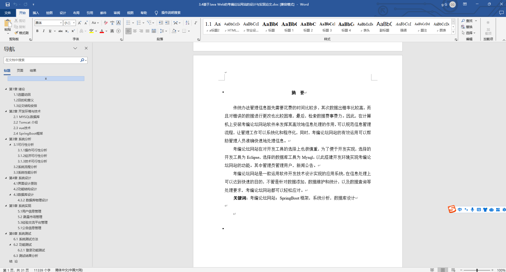
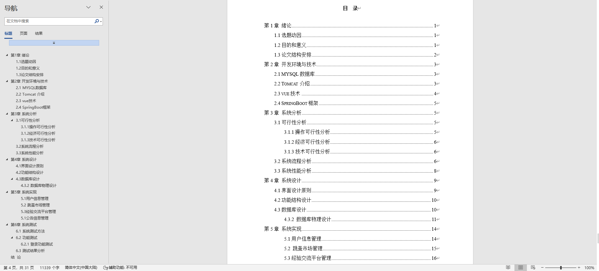

### 程序截图：
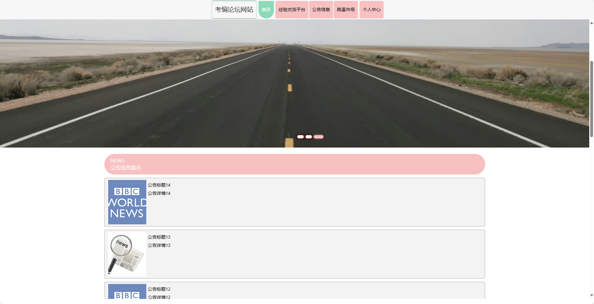
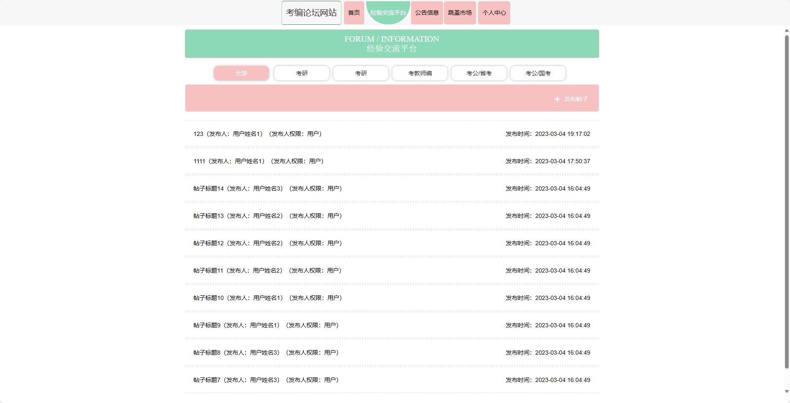
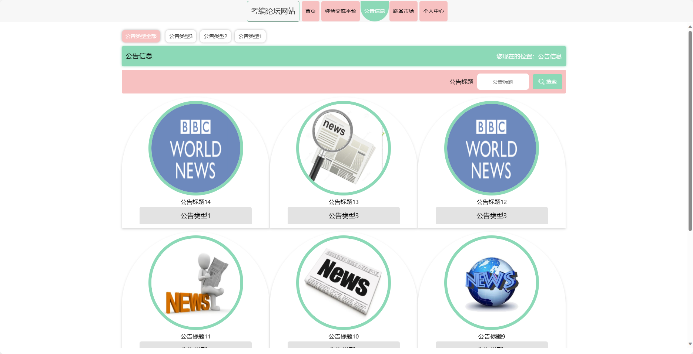
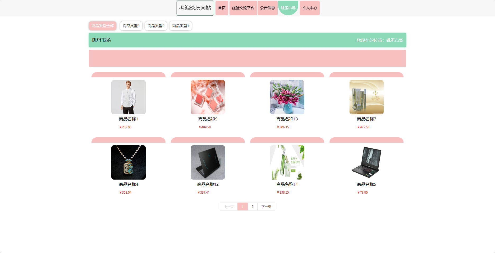
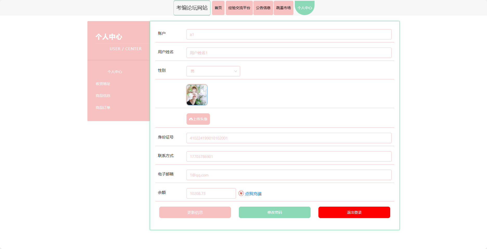
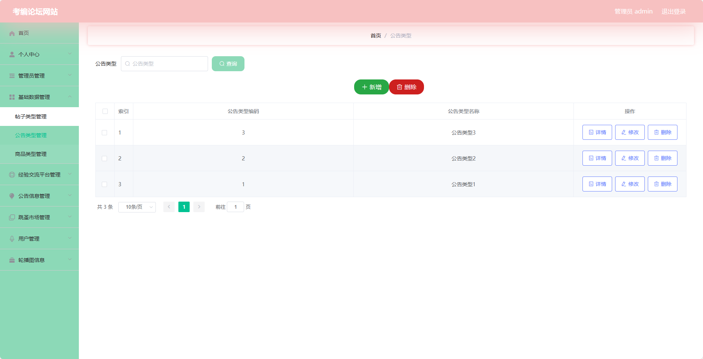
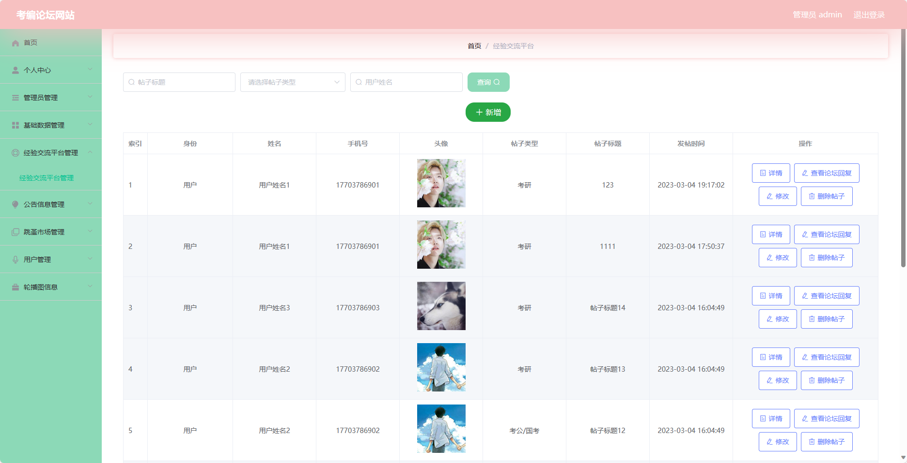
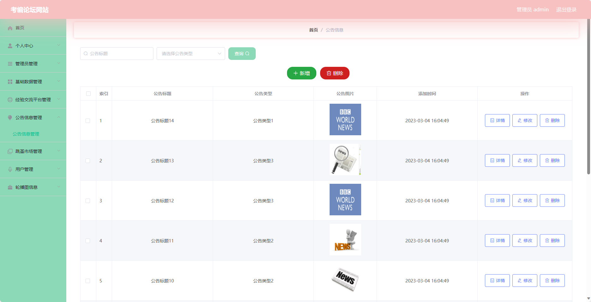
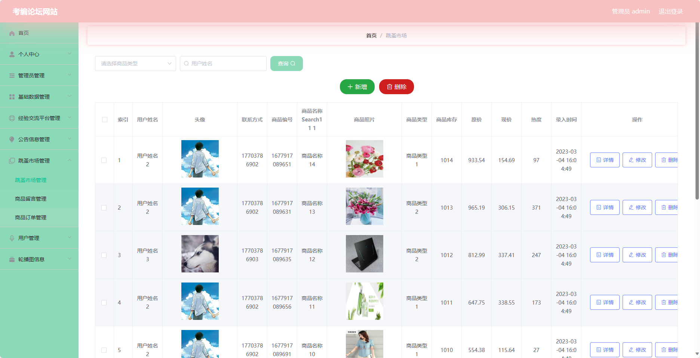
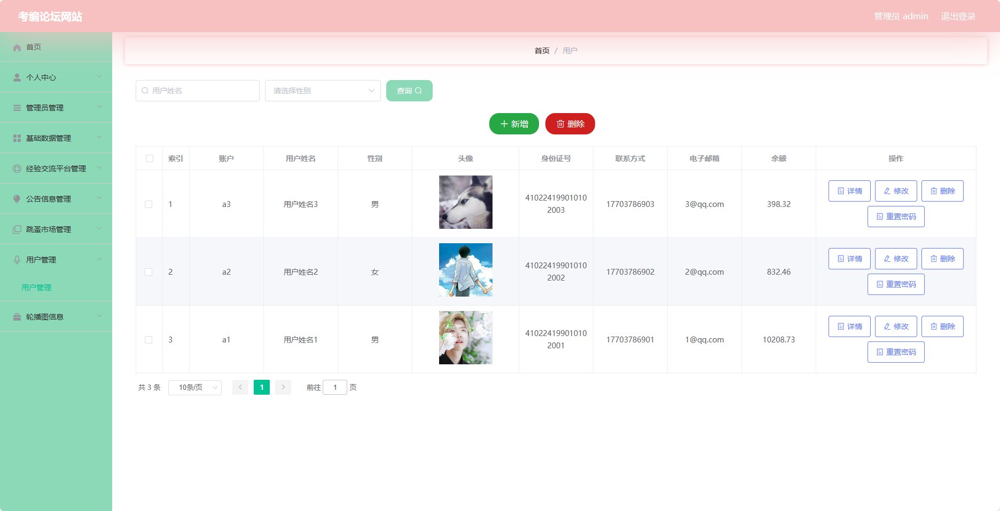

